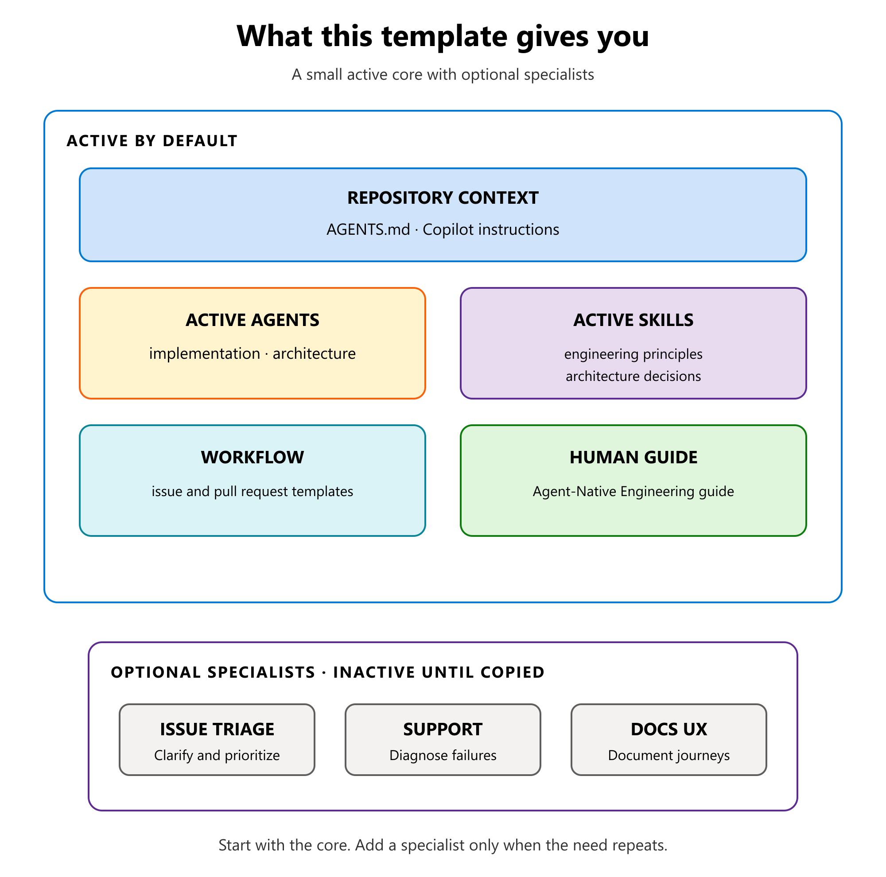

# Agent-Native Engineering

A practical GitHub Copilot starter template for repositories where agents do
real engineering work, not just autocomplete.

The template is ready to use with a deliberately small active core. It includes
two custom agents, foundational skills, and issue and pull request templates.
Optional specialist agents live in `catalog/` and are not discovered
automatically.

## Start here

1. Create a repository from this template, or copy the template files into an
   existing repository.
2. Open the repository with GitHub Copilot and give the main agent one small,
   real task:

   ```text
   I want to [describe a small, checkable outcome]. Inspect what already
   exists, propose the smallest plan, and tell me how you will verify it. Ask
   me only for decisions the repository cannot answer. Wait for my approval
   before editing.
   ```

3. Approve the plan, let Copilot implement it, and review the evidence.

That is enough to begin. The
[`Agent-Native Engineering guide`](docs/agent-native-engineering.md) explains
the model and the optional customization points.

> Active components load from their standard repository locations.
> `catalog/` files stay inactive until copied. Availability varies across
> GitHub.com, Copilot App, CLI, and IDEs. See the guide for loading and
> activation details.

## What you get

| Area | Included |
| --- | --- |
| Core behavior | [`AGENTS.md`](AGENTS.md) and [Copilot instructions](.github/copilot-instructions.md) |
| Active agents | [`implementation`](.github/agents/implementation.agent.md) and [`architecture`](.github/agents/architecture.agent.md) |
| Active skills | [Engineering principles](.github/skills/engineering-principles/SKILL.md) and [architecture decisions](.github/skills/architecture-decision/SKILL.md) |
| Optional catalog | [Specialist agents](catalog/) for triage, support, and documentation |
| Workflow | [Issue templates](.github/ISSUE_TEMPLATE/) and the [pull request template](.github/pull_request_template.md) |
| Human guide | The [Agent-Native Engineering guide](docs/agent-native-engineering.md) |

Use `implementation` when a task is understood and ready for code. Use
`architecture` when a structural or hard-to-reverse decision must be resolved
first.



## Optional: add GitHub Spec Kit

[GitHub Spec Kit](https://github.com/github/spec-kit) adds an optional
specification workflow generated for each project.

1. Install `specify-cli` using the official
   [installation guide](https://github.com/github/spec-kit/blob/main/docs/installation.md).
2. From the repository root, run the command for the environment:

   **Windows with PowerShell**

   ```powershell
   specify init --here --force --integration copilot `
     --integration-options="--skills" --script ps
   ```

   **Linux or cloud**

   ```shell
   specify init --here --force --integration copilot \
     --integration-options="--skills" --script sh
   ```

3. Review and commit the generated `.github/skills/speckit-*` and `.specify/`
   files.

The template does not pre-populate those files because Spec Kit generates
environment-specific scripts. These commands were verified with Spec Kit
0.13.2 and the generated skills were discovered by GitHub Copilot App.

## Sources and licensing

The principles in this template were informed by established work in software
architecture, implementation, Python, cloud-native systems, and agentic
engineering. [`sources.md`](.github/skills/engineering-principles/references/sources.md)
credits those conceptual references and offers further reading. Referenced
works are not reproduced in this repository.

This repository is available under the [MIT License](LICENSE).
