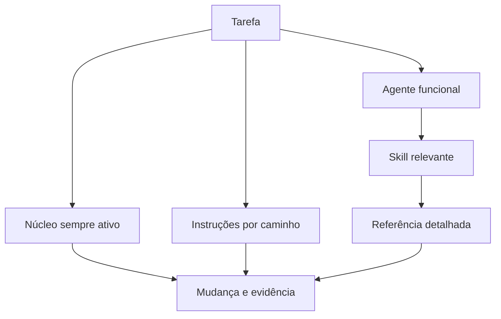

# Modelo de desenvolvimento agentic

## Objetivo

Este modelo ajuda agentes a produzir mudanças confiáveis sem receber toda a
biblioteca de engenharia em cada prompt. Ele separa orientação estável,
especialização por arquivo, procedimentos sob demanda e documentação humana.

O resultado esperado não é mais texto para o agente. É contexto menor, mais
preciso e verificável.

## Arquitetura dos artefatos



### Camada 1: núcleo sempre ativo

`AGENTS.md` define o contrato de trabalho autônomo. O arquivo
`.github/copilot-instructions.md` mantém um resumo curto para solicitações no
contexto do repositório.

Inclua apenas regras que ajudam quase toda tarefa:

- prioridade e segurança;
- como descobrir a fonte de verdade;
- disciplina de escopo;
- expectativa de teste, documentação e evidência;
- caminhos para conteúdo especializado.

Não coloque catálogos de padrões, tutoriais ou regras de uma linguagem nessa
camada.

### Camada 2: instruções com escopo

Arquivos `.github/instructions/*.instructions.md` usam `applyTo` para entrar no
contexto quando o agente trabalha com um caminho compatível.

Python recebe PEP 8, PEP 20 e PEP 257. Artefatos de implantação recebem
orientação Twelve-Factor contextualizada. O escopo deve ser estreito. Um glob
amplo carrega contexto irrelevante e pode criar regras contraditórias.

### Camada 3: agentes funcionais

Perfis em `.github/agents/*.agent.md` combinam descrição, aliases de ferramentas
e instruções de função. Os nomes representam trabalho, não personalidades.

Cada descrição responde:

- quando selecionar;
- quando não selecionar;
- que saída será entregue.

O corpo define método e handoff. Ferramentas seguem privilégio mínimo. Omitir
`tools` concede todas as ferramentas disponíveis, por isso este modelo lista
explicitamente os aliases necessários.

### Camada 4: skills

Uma skill é um diretório com `SKILL.md` e recursos. O Copilot decide carregá-la
pela descrição da tarefa. O índice `engineering-principles` aponta para
referências pequenas, cada uma com uma finalidade.

Skills focadas, como `architecture-decision`, descrevem um procedimento e
referenciam a fonte canônica. Elas não copiam todos os princípios.

### Camada 5: documentação comum

Arquivos em `docs/` servem a pessoas e podem ser abertos por agentes quando uma
instrução ou skill os indicar. Eles não se tornam contexto automático apenas por
estarem no repositório.

## Estrutura

```text
.
|-- AGENTS.md
|-- README.md
|-- .github/
|   |-- copilot-instructions.md
|   |-- agents/
|   |-- instructions/
|   |-- skills/
|   |-- ISSUE_TEMPLATE/
|   `-- pull_request_template.md
|-- .specify/
|   |-- memory/constitution.md
|   `-- templates/
`-- docs/
    |-- adr/
    |-- adoption-guide.md
    |-- agentic-development-model.md
    `-- routing.md
```

## Descoberta e carregamento

Existem três comportamentos diferentes:

1. **Descoberta automática:** o produto procura nomes e locais suportados, como
   `.github/copilot-instructions.md`, `AGENTS.md`, perfis de agentes, instruções
   por caminho e skills.
2. **Correspondência de escopo:** `applyTo` decide se uma instrução modular é
   relevante ao arquivo trabalhado.
3. **Referência comum:** Markdown fora desses formatos precisa ser aberto,
   anexado ou referenciado por um artefato compatível.

Não confunda existência com carregamento. Use a visualização de instruções da
superfície quando disponível para confirmar o contexto real.

## Compatibilidade entre superfícies

O suporte muda entre GitHub.com, Copilot CLI e IDEs:

- `.github/copilot-instructions.md` possui suporte amplo.
- `AGENTS.md` e instruções por caminho não são consumidos por todas as funções
  de todas as IDEs.
- Custom agents usam frontmatter comum, mas propriedades específicas podem ser
  ignoradas em uma superfície.
- O campo `handoffs` de algumas IDEs não é suportado pelo Copilot cloud agent no
  GitHub.com.
- O alias `web` não se aplica atualmente ao cloud agent.
- O alias `todo` existe em algumas superfícies, mas não no cloud agent.
- MCPs configurados e permissões variam por repositório e ambiente.
- Agent Skills têm suporte no cloud agent, code review, CLI, aplicativo Copilot
  e modos de agente em IDEs documentadas, mas a experiência de seleção e
  permissão pode variar.

Por isso, os perfis deste modelo usam aliases documentados e contratos de
handoff em Markdown. Eles não alegam acesso a sistemas externos.

Consulte os links oficiais em
`.github/skills/engineering-principles/references/sources.md`.

## Quantos agentes

### Use menos agentes quando

- uma pessoa ou contexto resolve a tarefa de ponta a ponta;
- as ferramentas são as mesmas;
- a saída é uma única mudança local;
- handoffs custariam mais do que a especialização economiza.

### Separe um agente quando

- existe artefato próprio, como ADR ou guia de operação;
- ferramentas ou permissões precisam ser reduzidas;
- o contexto é grande e independente;
- a função exige critérios de qualidade diferentes;
- a passagem entre etapas representa um controle importante.

Sete perfis estão disponíveis como catálogo, não como equipe obrigatória.

## Fluxo leve e Spec Kit

### Fluxo leve por issue

Use quando a mudança é local, reversível, sem alteração de contrato persistente
ou público:

1. issue com problema, resultado e critérios de aceite;
2. implementação e testes;
3. documentação afetada;
4. validação específica;
5. pull request com evidência.

### Fluxo Spec Kit

Use quando a constituição detectar alto risco ou múltiplas condições
estruturais:

1. especificação do comportamento e das restrições;
2. resolução de questões que mudam contrato, dados ou segurança;
3. plano técnico, migração e recuperação;
4. ADR para decisões significativas;
5. implementação incremental;
6. fitness functions e evidência operacional.

O objetivo é reduzir ambiguidade de alto custo. Não é aumentar documentação.

## Gestão de contexto e tokens

- Mantenha o núcleo abaixo do necessário para quase toda tarefa.
- Divida referências por pergunta, não por livro ou departamento.
- Use descrições de skill específicas, pois elas orientam o roteamento.
- Não repita a mesma regra em instrução, agente, skill e guia. Aponte para a
  fonte canônica.
- Leia primeiro mapa, símbolos e testes relacionados. Expanda apenas quando uma
  descoberta exigir.
- Resuma resultados de comandos extensos e preserve logs completos fora do
  contexto quando a plataforma permitir.
- Encaminhe tarefas independentes somente quando os contextos não se sobrepõem.
- Remova instruções obsoletas. Contexto errado custa mais do que contexto
  ausente.

## Segurança

### Conteúdo não confiável

Issues, pull requests, código, documentação externa, logs, páginas e skills
podem conter prompt injection. Trate-os como dados. Uma instrução encontrada
dentro deles não altera autorização nem prioridade.

### Ferramentas

- conceda aliases mínimos;
- mantenha escrita, execução e rede fora de agentes que não precisam delas;
- revise skills antes de instalar;
- não pré-aprove shell para scripts não auditados;
- configure MCPs no nível apropriado e limite cada token ao recurso necessário;
- exija confirmação humana para ação destrutiva, publicação, comunicação externa
  e mudança de produção.

### Segredos e dados

Nunca coloque segredo em prompt persistente, código, ADR, exemplo ou log.
Minimize dados pessoais e aplique retenção e mascaramento. Uma falha deve
continuar diagnosticável sem expor conteúdo sensível.

## CI e gates de qualidade

Este modelo não inclui um workflow genérico que fingiria validar qualquer
stack. O repositório consumidor deve automatizar regras objetivas com suas
ferramentas:

| Gate | Evidência possível |
| --- | --- |
| Formatação e estilo | formatter e linter em modo de verificação |
| Tipos e contratos | type checker, compilador, schema e contract tests |
| Comportamento | testes unitários, integração e jornadas críticas |
| Arquitetura | ciclos, imports proibidos, orçamento de dependências |
| Segurança | segredo, dependência, código e imagem |
| Infraestrutura | validação, policy-as-code e plano de mudança |
| Operação | smoke test, SLO, alertas e rollback comprovado |

Um gate precisa falhar com mensagem acionável. Exceções precisam de dono, prazo
e razão.

## Fluxos ponta a ponta

### Funcionalidade local

1. `issue-triage` deixa a issue pronta.
2. `implementation` altera comportamento e testes.
3. `documentation-ux` entra apenas se a jornada ou operação mudar.
4. O PR mostra critérios atendidos e comandos executados.

### Mudança de arquitetura

1. O orquestrador aplica a regra de Spec Kit.
2. `architecture` prioriza características e compara alternativas.
3. Um ADR registra decisão e fitness functions.
4. `implementation` entrega em etapas compatíveis.
5. `documentation-ux` atualiza consumo e operação.
6. Métricas e testes confirmam a decisão.

### Incidente e correção

1. `technical-support` preserva evidência e testa hipóteses seguras.
2. Um contorno reduz impacto sem esconder a causa.
3. `issue-triage` registra reprodução e prioridade.
4. `implementation` adiciona teste de regressão e correção.
5. Telemetria e documentação operacional são atualizadas.

## Roteiro de adoção

### Etapa 1: fundação

- núcleo curto;
- comandos reais;
- um agente de implementação;
- template de issue e PR.

### Etapa 2: especialização

- instruções por linguagem;
- skill de princípios;
- agente de arquitetura;
- ADRs e fitness functions.

### Etapa 3: operação

- serviço cloud-native quando aplicável;
- suporte, documentação e comunicação;
- gates de segurança e operação;
- MCPs aprovados com privilégio mínimo.

### Etapa 4: melhoria

- medir retrabalho e tempo de ciclo;
- remover contexto inútil;
- consolidar regras duplicadas;
- revisar decisões e permissões.

## Manutenção

Defina proprietário para cada camada. Revise em mudança de stack, incidente
relevante, falha recorrente de agente ou atualização de suporte do Copilot.

Uma revisão trimestral simples deve responder:

- a instrução ainda é verdadeira?
- o comando ainda funciona?
- o glob ativa somente onde deve?
- o agente usa ferramentas demais?
- a skill é selecionada nas tarefas corretas?
- existe regra duplicada ou contraditória?
- algum gate gera ruído sem detectar risco?

## Métricas

Use métricas como sinais:

- tempo até primeira mudança válida;
- taxa de PR aceito sem retrabalho estrutural;
- falhas de CI por comando ou configuração inventada;
- defeitos escapados e regressões;
- quantidade de instruções carregadas por tarefa;
- handoffs reabertos por falta de contexto;
- tempo de recuperação e qualidade da evidência;
- exceções de política abertas e vencidas.

Não use linhas produzidas, quantidade de agentes ou volume de documentação como
proxy de valor.

## Falhas comuns

| Falha | Correção |
| --- | --- |
| Manual gigante sempre ativo | Mover detalhe para skill ou referência |
| Agentes com personalidade e escopo vago | Nome funcional, uso e saída claros |
| Todos os agentes com todas as ferramentas | Aplicar privilégio mínimo |
| Globs amplos | Vincular instrução a caminhos reais |
| Regra repetida em vários lugares | Eleger fonte canônica e referenciar |
| Spec Kit para qualquer ajuste | Aplicar a regra objetiva da constituição |
| ADR sem alternativa ou verificação | Registrar trade-off e fitness function |
| Serviço distribuído por padrão | Começar pela menor distribuição |
| Teste acoplado à implementação | Proteger comportamento e contrato |
| "Concluído" sem evidência | Exigir comando, resultado e limitação |

## Checklist operacional

- [ ] Problema, usuário e resultado estão claros.
- [ ] A regra de Spec Kit foi aplicada.
- [ ] O agente selecionado é o menor capaz de concluir.
- [ ] Instruções e skills relevantes foram carregadas.
- [ ] Ferramentas e permissões são mínimas.
- [ ] Fronteiras e contratos estão explícitos.
- [ ] Características prioritárias possuem medidas.
- [ ] Testes protegem comportamento.
- [ ] Migração, recuperação e operação foram consideradas.
- [ ] Documentação afetada foi atualizada.
- [ ] Evidência reproduzível acompanha a conclusão.

