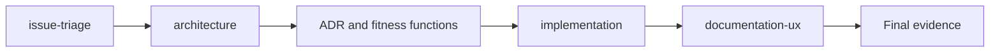
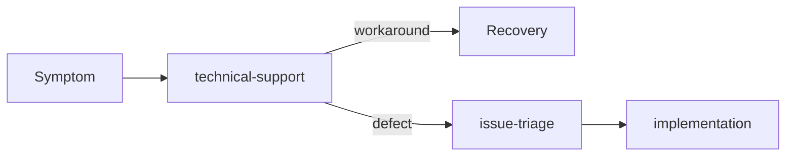

# Routing and handoff contracts

Choose the smallest number of agents capable of completing the task. A
single agent is preferable when there is no real benefit from
specialization or context isolation.

## Task to agent

| Task | Primary agent | Do not use when |
| --- | --- | --- |
| Coordinate multiple disciplines and dependencies | `engineering-orchestrator` | A local edit has a clear path |
| Implement, test, and adjust code | `implementation` | Requirements or structural decisions are still open |
| Classify and prepare the backlog | `issue-triage` | The task is already ready for implementation |
| Decide boundaries, contracts, or trade-offs | `architecture` | There is no relevant architectural decision |
| Explain usage, configuration, and operation | `documentation-ux` | The behavior has not yet been confirmed |
| Diagnose a failure and guide recovery | `technical-support` | The action would be destructive or a product decision |
| Prepare a professional message | `workplace-communications` | Access or sending has not been authorized |

## Minimal handoff contract

Every handoff contains:

- objective and affected audience;
- source of truth for requirements;
- relevant artifacts and paths;
- decisions made and alternatives rejected;
- scope included and excluded;
- risks, uncertainties, and permissions;
- exit condition and expected evidence.

The receiving agent confirms what it received and does not reopen decisions
without new evidence.

## Common flows

### Simple change

### Structural change

### Reported failure

## Surface limitations

Profiles use only official tool aliases in the frontmatter. Handoffs are
contracts in the body of the profiles and in this document. The `handoffs`
frontmatter field may exist in some IDEs, but it is ignored by the Copilot
cloud agent on GitHub.com. Do not rely on it to complete the flow.

External tools, such as email, calendar, chat, cloud, or observability,
depend on authorized MCPs or integrations. An agent name does not grant
access. If the tool is not available, the agent must produce a draft or a
verifiable instruction, never claim it performed the action.

