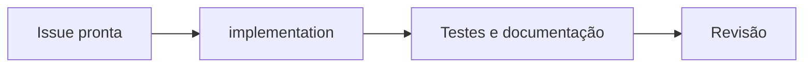
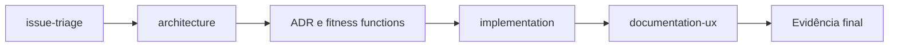
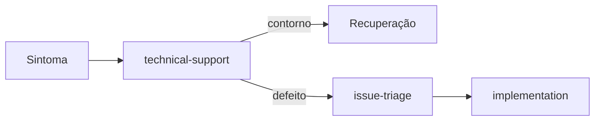

# Roteamento e contratos de handoff

Escolha o menor número de agentes capaz de concluir a tarefa. Um único agente é
preferível quando não há benefício real de especialização ou isolamento de
contexto.

## Tarefa para agente

| Tarefa | Agente principal | Não usar quando |
| --- | --- | --- |
| Coordenar várias disciplinas e dependências | `engineering-orchestrator` | Uma edição local tem caminho claro |
| Implementar, testar e ajustar código | `implementation` | Requisitos ou decisões estruturais estão abertos |
| Classificar e preparar backlog | `issue-triage` | A tarefa já está pronta para implementação |
| Decidir fronteiras, contratos ou trade-offs | `architecture` | Não existe decisão arquitetural relevante |
| Explicar uso, configuração e operação | `documentation-ux` | O comportamento ainda não foi confirmado |
| Diagnosticar falha e orientar recuperação | `technical-support` | A ação seria destrutiva ou de produto |
| Preparar mensagem profissional | `workplace-communications` | Acesso ou envio não foi autorizado |

## Contrato mínimo de handoff

Todo handoff contém:

- objetivo e público afetado;
- fonte de verdade para requisitos;
- artefatos e caminhos relevantes;
- decisões tomadas e alternativas rejeitadas;
- escopo incluído e excluído;
- riscos, incertezas e permissões;
- condição de saída e evidência esperada.

O agente receptor confirma o que recebeu e não reabre decisões sem nova
evidência.

## Fluxos comuns

### Mudança simples

### Mudança estrutural

### Falha reportada

## Limites das superfícies

Os perfis usam apenas aliases oficiais de ferramentas no frontmatter. Handoffs
são contratos no corpo dos perfis e neste documento. O campo de frontmatter
`handoffs` pode existir em algumas IDEs, mas é ignorado pelo Copilot cloud agent
no GitHub.com. Não dependa dele para completar o fluxo.

Ferramentas externas, como email, calendário, chat, nuvem ou observabilidade,
dependem de MCPs ou integrações autorizadas. Um nome de agente não concede
acesso. Se a ferramenta não estiver disponível, o agente deve produzir um
rascunho ou instrução verificável, nunca alegar que executou a ação.

